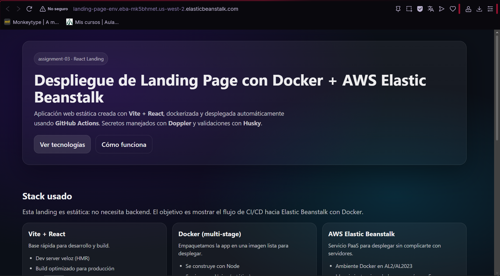
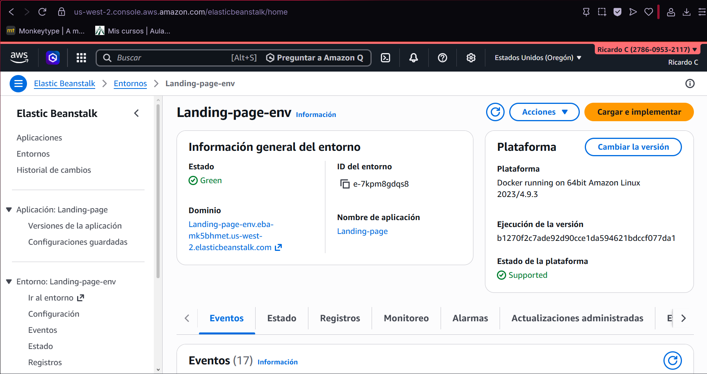
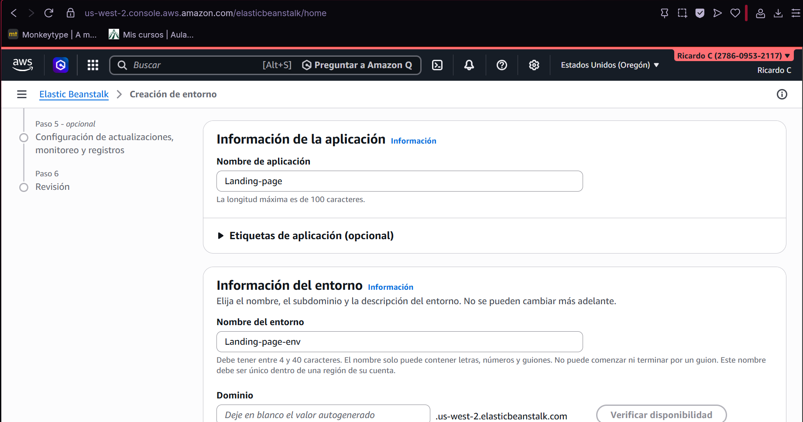
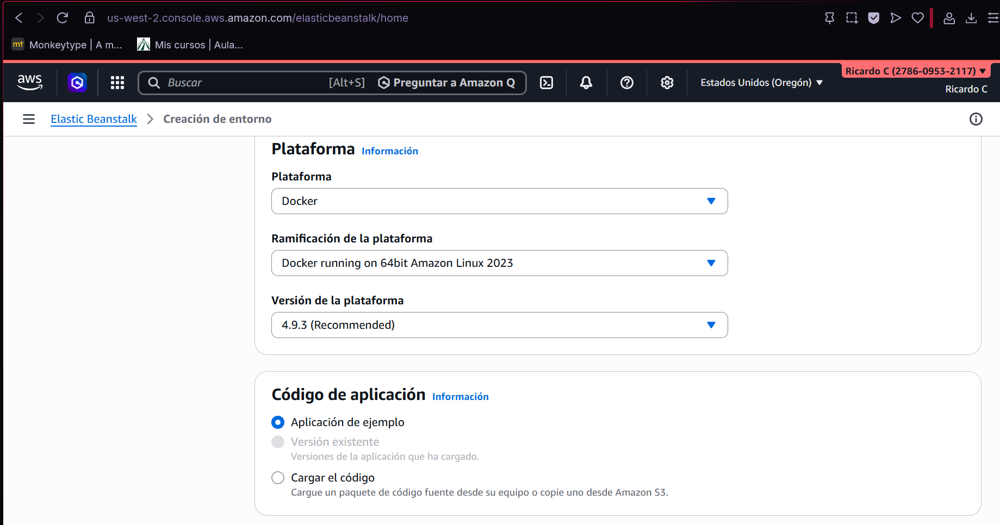
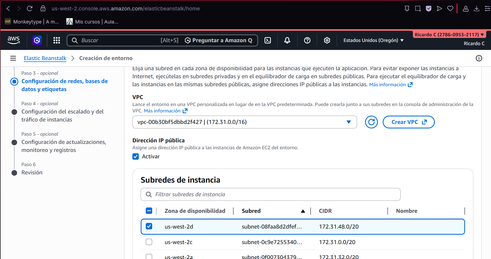

## Captura de la aplicación

---

## URL pública (AWS Elastic Beanstalk)
- **Environment URL:** http://landing-page-env.eba-mk5bhmet.us-west-2.elasticbeanstalk.com
**Debe ser sin https, solo http**

## Husky (¿qué hace y cómo se usa?)
Se configuró **Husky** para ejecutar un *hook* de **pre-commit**.  
Antes de registrar un commit, Husky ejecuta **lint-staged**, lo cual corre **ESLint** únicamente sobre los archivos que están en *staging* (los que se van a commitear).  
Esto ayuda a mantener el código consistente y evita subir commits con errores de estilo o problemas simples.

##  Capturas requeridas 
### 1) AWS Elastic Beanstalk (Environment)

### 2) Configuración de Elastic Beanstalk

